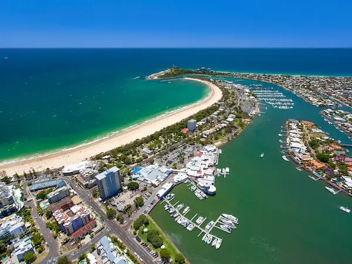

We would like to cordially invite you to Queensland for the Australasian Applied Statistics Conference 2026 (AASC2026) to be held from the 30th November to the 4th December 2026 at the [**Mantra Mooloolaba Beach**](https://www.mantramooloolababeach.com.au/) on the Sunshine Coast. AASC2026 is for anyone passionate about real-world data analysis, providing opportunities to exchange ideas in all areas of applied statistics, as well as encouraging networking and collaboration. Whether you are a student, researcher, industry representative, or simply have a keen interest in anything related to data science, AASC2026 will provide plenty of opportunities to learn, engage, share, and connect with fellow data science enthusiasts in a friendly and welcoming setting.

# [Conference registration is now open](https://aasc2026.netlify.app/registration)

## <i class="fas fa-calendar"></i> Important dates



 

## Sponsorship

If you or your organisation are interested in sponsoring the conference, please email interest to [the conference organisers](mailto:michael.mumford@dpi.qld.gov.au)

## Contact Information

For general inquiries regarding the AASC 2026 conference, please contact [the secretary](mailto:michael.mumford@dpi.qld.gov.au)

## Australian Data Science Network Conference 2026

Looking for another conference to attend just prior to AASC2026? The Australian Data Science Network (ADSN) 2026 conference will be held on Thursday the $26^{th}$ and Friday the $27^{th}$ November in Canberra the week before AASC2026. See the [ADSN conference website](https://adsnconf2026.netlify.app/) for more information.