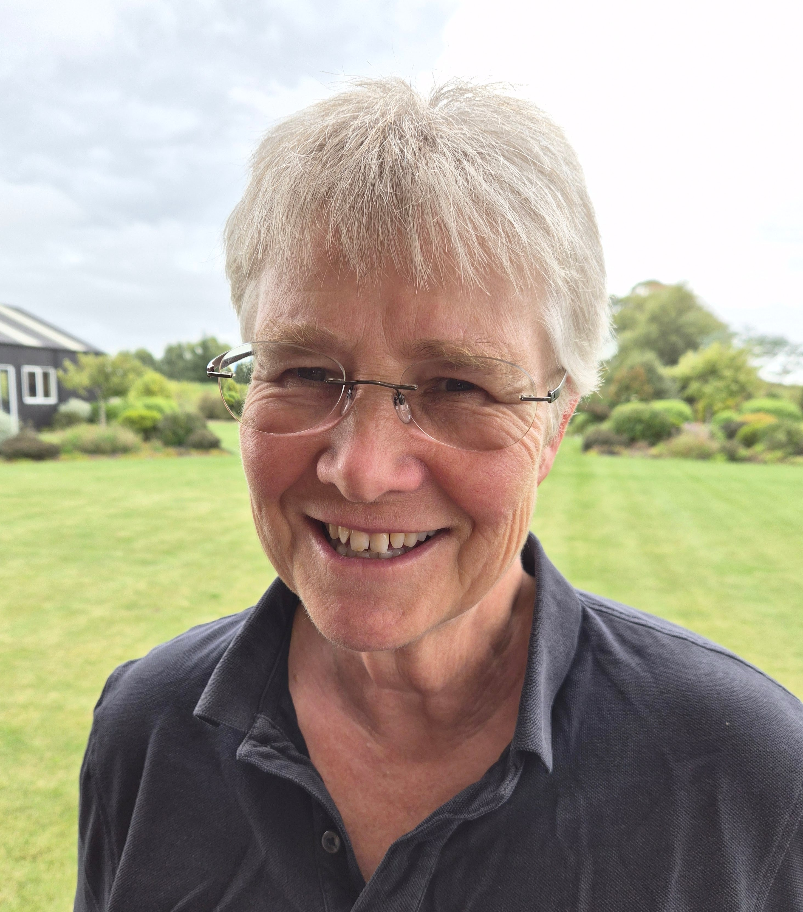

## Dr. Petra Kuhnert{.collapsible .collapsed}

```{r, echo=FALSE, out.width="30%", fig.align='center'}

```

### Title 

AI is a Crime Scene: sifting through the slop to deliver Responsible Application-Driven solutions

### Abstract

Artificial Intelligence (AI) is moving at a rapid pace, shaping decisions across sectors and communities. As a result, the number of paper submissions to leading AI venues has surged.  For example, in 2025, a little over 71,000 papers were submitted to the main research track of five of the top machine learning conferences, representing a 32% increase since 24 and a 10-fold increase from ten years ago. This rise in volume is becoming increasingly difficult to manage and consume in the academic community. Alongside genuine advances, there is also work that is incremental, overly tuned to curated benchmarks, weakly evidenced or even AI-generated without adequate verification.

If we want AI research and deployed systems that are trusted, robust and transparent, we need a forensic lens on how AI and its underlying analytics are developed and evaluated. For me, Statistics provides that lens, yet it can be sidelined in the rush to publish AI and deploy. 

In this talk, I use the metaphor of a crime scene to describe AI crime: errors in predictions, uncertainty and inference that lead to poor decisions and in high-stakes settings can translate into real-world harm. I outline what Responsible, Application-Driven AI (RAD-AI) looks like in practice, and the statistical checks and incentives that help prevent failure modes and AI crime before it reaches the field. I will illustrate these ideas with work we are developing with stakeholders to produce a trusted AI crop growth model. 

We would not cut corners at a crime scene, so why would we allow crime to happen with AI!


### Bio 
Dr. Petra Kuhnert is a Senior Principal Research Scientist at CSIRO and an expert at the intersection of statistics and machine learning. Her work develops methodology for risk-based decision-making in environmental and agricultural applications where she develops methods that are fit for purpose, relevant to the question at hand, and usable by decision-makers.

Her work, particularly supporting Great Barrier Reef decision-making, has been recognised through awards including 1st Runner Up (APAC Women in AI Innovator of the Year, 2023) and the APAC Women in AI Award for Environment and Biodiversity (2023). 

A key contribution to AI-driven decision-making is her award-winning software Vizumap, an R package that helps users understand and communicate uncertainty on maps.

More recently, her focus has included machine-learning emulators to speed up slow-running physical system models, Bayesian methods for decision support, and approaches that use geospatial data (e.g., remote sensing) to improve prediction of terrestrial environmental and agricultural processes.

Her previous roles include Associate Science Director for University Engagement and Group Leader of the Statistical Machine Learning Group in CSIRO’s Data61.
She has co-authored 100+ journal articles, with 6,000+ citations and a Google Scholar h-index of 30+. Her collaborations span leading government departments, universities and industry.


## Dr. Ruth Butler{.collapsible .collapsed}

```{r, echo=FALSE, out.width="30%", fig.align='center'}

```

### Title 

TBA

### Abstract

TBA

### Bio 

Dr. Ruth Butler has worked as a biometrician/statistical consultant for more than 35 years, initially in the UK, then from the mid-1990s in New Zealand. She has primarily worked with bio-protection scientists (plant pathology, entomology), but also has significant experience working with other non-medical biological scientists including in soils/agronomy, food research and plant breeding. Ruth has been a Genstat user throughout her career, contributing around 10 Genstat procedures, and has been a beta tester of Genstat for 30 years. Ruth has also been a CycDesigN user since the very first version was released in 1997. Her interests are in good data management practices, well-designed experiments, and in improving communication between statisticians and scientists.


